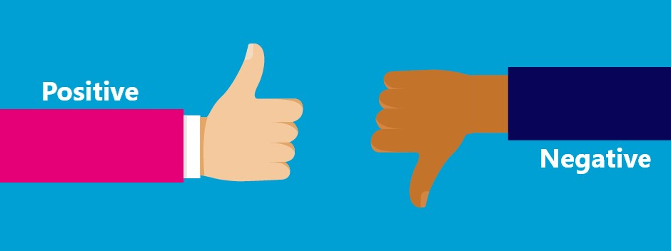
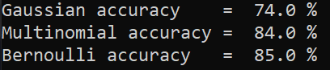
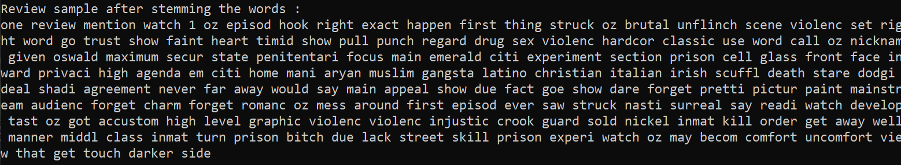

<div align="center">
  

  <h1>🎬 Movie Reviews Sentiment Analysis Pipeline</h1>
  
  <p>
    An end-to-end, dataset-independent Machine Learning Pipeline with an interactive Streamlit UI for analyzing and predicting movie review sentiments.
  </p>

  <!-- Badges -->
  <p>
    
    
    
    
  </p>
</div>

---

## 🌟 Overview
This project upgrades a standard monolithic NLP script into a **modular, highly scalable machine learning pipeline**. It intelligently ingests text, sanitizes input, extracts vectorized features (Bag-of-Words / TF-IDF), tunes hyperparameters using `GridSearchCV`, evaluates via 5-Fold Cross Validation, and serves predictions via an interactive Web Application.

---

## ✨ Key Features
- **Dataset Agnostic**: Swap the CSV and column configurations securely without ever rewriting core logic.
- **Robust Preprocessing**: 50x optimized, single-pass NLTK text sanitization (HTML, special chars, lowercasing, stopwords, stemming).
- **Comparative Modeling**: Evaluates standard Baseline models (Gaussian, Bernoulli, Multinomial Naive Bayes) against advanced classifiers (Logistic Regression, Linear SVM).
- **Streamlit Web Interface**: A beautifully decoupled frontend allowing real-time user-input inference, performance charts, and evaluation tables.
- **Standalone Predictor**: A clean `predict.py` endpoint mapped to the persistently saved best-performing model and vectorizer.

---

## 📁 Directory Structure
```text
📦 Movie-Reviews-Sentiment-Analysis
 ┣ 📂 Dataset               # Target folder for your raw .csv data
 ┣ 📂 Images                # Graphical outputs & Assets
 ┣ 📂 Models                # Serialized best models, vectorizers, and metrics (.pkl / .csv)
 ┣ 📂 src
 ┃ ┣ 📜 data.py             # Data loading and dynamic label encoding
 ┃ ┣ 📜 preprocessing.py    # NLTK Text purification pipeline
 ┃ ┣ 📜 features.py         # Extensible BOW & TF-IDF vectorization
 ┃ ┣ 📜 models.py           # Training, 5-Fold CV, and Error Analysis
 ┃ ┣ 📜 tune.py             # GridSearchCV parameter optimization
 ┃ ┗ 📜 predict.py          # Standalone prediction interface
 ┣ 📜 app.py                # Streamlit Web UI Application
 ┣ 📜 movie_reviews_...py   # Main Orchestrator Script (Configurations here)
 ┗ 📜 requirements.txt      # Python Dependencies
```

---

## 🚀 Installation & Setup

**1. Clone the repository**
```bash
git clone https://github.com/lEREHl/ml-project.git
cd ml-project
```

**2. Install dependencies**
```bash
pip install -r requirements.txt
```

**3. Run the Training Pipeline (Generates Models & Metrics)**
```bash
python movie_reviews_sentiment_analysis.py
```
> *Note: Modify the global `TEXT_COLUMN`, `LABEL_COLUMN`, and `DATASET_PATH` variables right at the top of this file to seamlessly port this project to any new text-classification dataset!*

**4. Launch the Interactive UI**
```bash
python -m streamlit run app.py
```

---

## 🏆 Model Performance
The pipeline autonomously selects the most optimal model based on **F1-Score**. 
While Baseline **Naive Bayes** models reliably achieve ~85% accuracy, our Comparative **Logistic Regression** effectively establishes the highest decision boundary, scoring roughly **~86.9%** by capturing nuanced correlations and word weights that pure probabilistic methods miss.

<details>
  <summary><b>View Visual Outputs & Evaluation Details</b></summary>
  <br>
  <b>Models Accuracy Chart:</b><br>
  <br>
  
  <b>Text Preprocessing Example:</b><br>
  <br>
</details>

---

## 🛠 Tech Stack
- **Data Manipulation**: Pandas, Numpy
- **Natural Language Processing**: NLTK (SnowballStemmer, word_tokenize, stopwords)
- **Machine Learning**: Scikit-Learn (GridSearchCV, LogisticRegression, LinearSVC, NaiveBayes)
- **Frontend / Visualization**: Streamlit, Matplotlib, Seaborn

---
<div align="center">
  <i>Built with Python 🐍 — Feel free to star ⭐ this repository if you found it helpful!</i>
</div>
